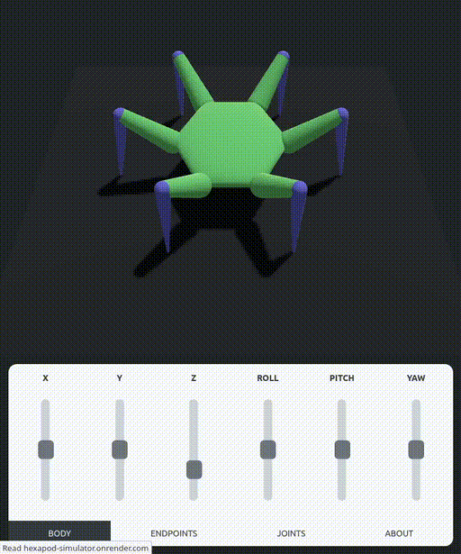

# Interactive Hexapod Solver

<p align="center">
<a href="https://hexapod-simulator.onrender.com/"><b>Try it out here!</b></a>
</p>



## Details

The 3D visualization is powered by the three.js library. The inverse kinematics calculations use trigonometry instead of an iterative solver, while forward kinematics leverage Denavit–Hartenberg parameters. Animations are achieved using Catmull-Rom (centripetal) splines for interpolation and Bézier curves for easing.

The interface is built with TypeScript, SASS, and good old HTML.

## Running Locally

First make sure you have Node.js and npm installed!

```bash
git clone https://github.com/mut-ex/hexapod-simulator.git
cd hexapod-simulator
npm install
npm run dev
```

Then open `http://localhost:5173/` in your browser.
